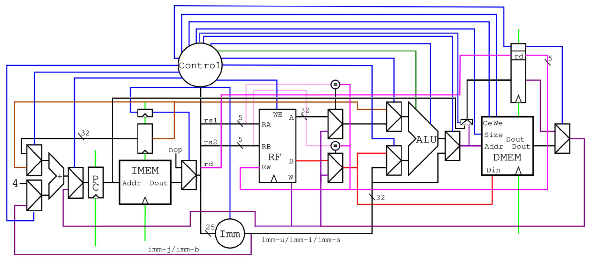
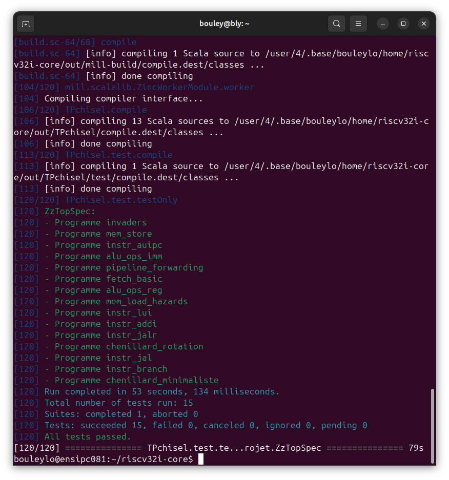

# 🚀 3-Stage Pipelined RISC-V Core (RV32I)

## 📖 Overview

This project involves the design and implementation of a 32-bit RISC-V processor (RV32I subset) using Chisel (Hardware Construction Language). The processor features a 3-stage pipeline (Fetch, Decode/Execute, WriteBack) and handles data hazards via a dedicated forwarding unit.

The core was synthesized and successfully deployed on a Digilent Zybo FPGA to run interactive applications like Space Invaders and LED animations.


## 🏗 Architecture



The processor implements the classic RISC-V Von Neumann architecture with the following features:

-   **ISA**: RV32I (Base Integer Instruction Set).
-   **Pipeline**: 3 Stages to optimize throughput given BRAM latency constraints.
    1.  **Fetch**: Instruction retrieval from IMEM.
    2.  **Decode / Execute**: Register File access, ALU operations, Branch resolution.
    3.  **Write Back**: Memory access (Load/Store) and Register Write-back.
-   **Hazard Management**: Full Data Forwarding (Bypassing) logic to resolve Read-After-Write (RAW) hazards without stalling (removing NOPs).
-   **Control Hazards**: Branch prediction assumes "not taken", with pipeline flush on branch taken.
-   **Memory**: Harvard-style logical separation (IMEM/DMEM) mapped to Dual-Port BRAM.


## 🛠️ Tech Stack

-   **Language**: Scala 2.13 / Chisel 3
-   **Build Tool**: Mill
-   **Simulation**: Verilator / GTKWave
-   **Synthesis & P&R**: Xilinx Vivado 2019.1
-   **Hardware**: Digilent Zybo Z7-10 - Xilinx Zynq-7000 ARM/FPGA SoC development board


## 📸 Demo

### FPGA Implementation (Space Invaders)


### Simulation Waveforms


*Figure: Waveform showing the instruction pipeline, hazard resolution, and a taken conditional branch (`beq`)*


## 🚀 How to Run

### Simulation

All test files are located in the `bench/` directory and are written in **RISC-V assembly**.

**Run all unit tests:**

``` bash
# Run unit tests
make autotest
```

*Expected output:*



**Run a specific unit test (e.g. instr_jalr.s):**

``` bash
make autotest PROG=instr_jalr
```

**Run simulation for GTKWave visualization:**

``` bash
# This runs the simulation without checking results automatically,
# allowing you to inspect waveforms in GTKWave even if the test logic isn't fully implemented.
make simulation PROG=instr_jalr
```


### FPGA Deployment

``` bash
# Generate Bitstream and Program the Board
make fpga PROG=invaders
```

*Action: After synthesis (which may take a few minutes), the bitstream is uploaded to the Zybo board. The application (e.g., Space Invaders) starts running immediately on the connected VGA display / LEDs.*


## 🎓 Context

This project was realized as part of the "Fondements Matériels du Numérique" (Digital Hardware Foundations) curriculum at Ensimag (Grenoble INP), National School of Computer Science and Applied Mathematics.

## 👥 Contributors

* **[Loïs Bouley]** - [LinkedIn](https://www.linkedin.com/in/lo%C3%AFs-bouley-0b0276385/)
* **[Marwa El Khazrouni]** - [LinkedIn](https://www.linkedin.com/in/marwa-el-khazrouni-a6a47727b/)
